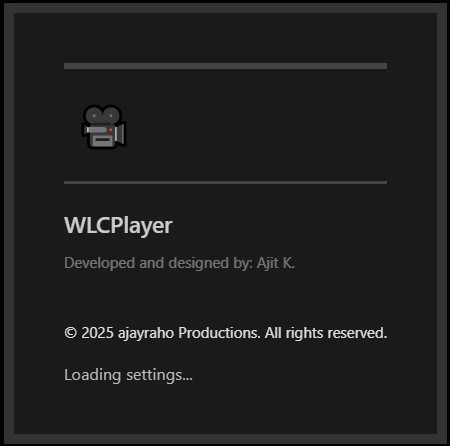
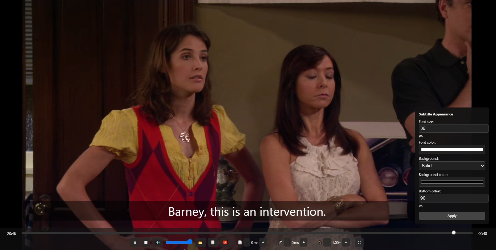

# WLCPlayer - Advanced Local Video Player Extension

*A feature-rich Chrome extension for playing local video files with advanced subtitle and audio controls*

## Table of Contents
- [Demo](#demo)
- [Overview](#overview)
- [Features](#features)
- [Installation](#installation)
- [Usage](#usage)
- [Key Features](#key-features)
- [Controls](#controls)
- [Privacy & Permissions](#privacy--permissions)
- [Developer](#developer)

## Demo

## Overview
WLCPlayer is a sophisticated Chrome extension designed to provide an enhanced video playback experience for local video files. It offers precise control over subtitles, audio synchronization, and playback speed, all within a clean and intuitive interface. This is most helpful when watching some downloaded movie while sharing screen with your loved ones.

## Features
- 🎥 Local video file playback
- 📄 Subtitle support with timing adjustments
- 🔊 Audio synchronization controls
- ⚡ Playback speed control
- 🎨 Customizable subtitle appearance
- 🖥️ Full-screen support
- 🔧 Advanced subtitle settings
- 🎵 Volume control with mute option
- 🎯 Precise seeking capabilities

## Installation
1. Open Chrome Extensions page (`chrome://extensions/`)
2. Enable Developer Mode
3. Load the extension directory
4. The WLCPlayer icon will appear in your Chrome toolbar

## Usage
1. Click the WLCPlayer icon in your Chrome toolbar
2. A new tab will open with the player interface
3. Use the file button (📂) to open a local video file
4. Optional: Load subtitles using the subtitle button (📄)

## Key Features

### Video Playback
- Play/Pause/Stop controls
- Seek bar for navigation
- Volume control with mute option
- Full-screen mode

### Subtitle Management
- Load external subtitle files
- Adjust subtitle timing (+/- 100ms)
- Customize font size and color
- Background color options
- Position adjustment

### Audio Control
- Audio delay adjustment
- Volume slider
- Mute toggle

### Playback Settings
- Speed control
- Video progress tracking
- Time remaining display

## Controls

### Basic Controls
- ⏵ Play/Pause (Space)
- ⏹ Stop (S)
- 🔊 Mute/Unmute (M)
- Volume Control (↑/↓)
- 📂 Open Video File
- 📄 Load Subtitles

### Advanced Controls
- Subtitle Delay: [-/+] keys
- Audio Sync Adjustment
- Playback Speed Control
- Font Size/Color Settings
- Position Adjustment
- Background Color Options

## Privacy & Permissions

### Required Permissions
- **Storage Access**: Used to save your preferences and settings
- **File System Access**: Required to open local video files and subtitles
- **Tab Creation**: Needed to open the player in a new tab

### Privacy Policy
- ✅ **No Data Collection**: WLCPlayer does not collect or transmit any personal data
- ✅ **Local Processing**: All video and subtitle processing happens locally on your device
- ✅ **No External Services**: The extension works completely offline
- ✅ **No Analytics**: We don't track usage or collect analytics

### Data Storage
- Only stores user preferences (subtitle settings, volume level, etc.)
- All data is stored locally in Chrome's storage
- Data can be cleared by removing the extension

### Security
- Files are processed locally in your browser
- No network requests are made
- No external scripts or resources are loaded
- All code is open for inspection

---

Created by Ajit

